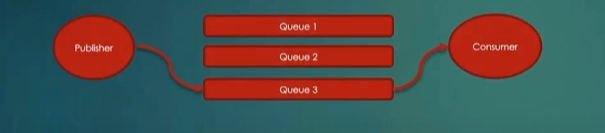
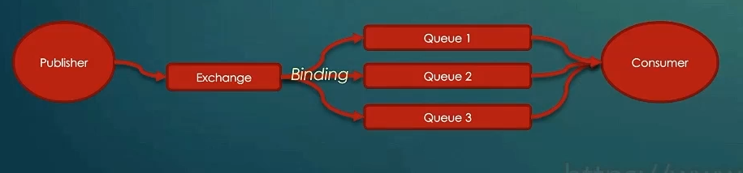
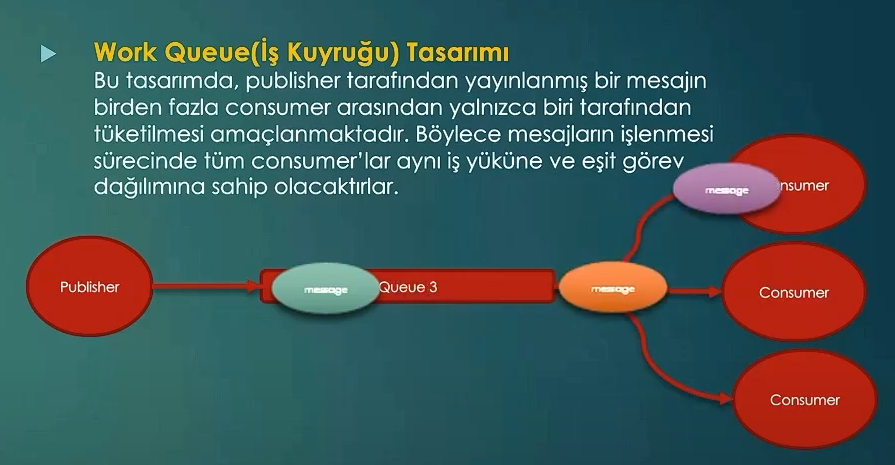
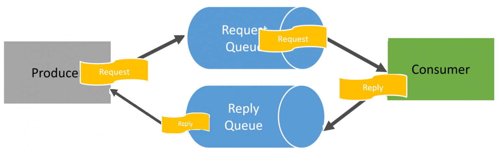

# RabbitMQ Mesaj Tasarımları

Design Pattern'larda olduğu gibi belli başlı senaryolara karşı gösterilecek önceden tanımlanmış, tarif edilmiş ve pratiksel olarak adımları saptanmış davranışlardır.
Belirli bir problemi çözmek için kullanılan bu tasarımlar, genel anlamda yapısal davranışları ve iletişim modelini ifade ederler.

<u>İki servis arasında message broker ile yapılacak haberleşme sürecinde iletilecek mesajların nasıl iletileceğini, nasıl işleneceğini, ne şekilde yapılandırılacağını ve ne tür bilgiler taşıyacağını belirler.
</u>
Her tasarım farklı bir uygulama senaryosuna ve gereksinime göre şekillenmekte ve en iyi sonuçlar alınabilecek şekilde yapılandırılmaktadır. 

Mesaj tasarımı senaryoya odaklıyken, senaryoda çözüm amaçlı fiili eylem bir design pattern olabilir.
Saga desing pattern, mesaj tasarımında uygulanabilecek bir davranış olabilir.Design pattern bir derece daha pratiğe yakındır.

## Yaygın Olarak Kullanılan Mesaj Tasarımları :

### P2P ( Point to Point) 
Bir publisher ilgili mesajı direkt bir kuyruğa gönderir ve bu mesajı kuyruğu dinleyen/işleyen bir consumer tarafından tüketilir.Senaryo gereği bir mesajın bir tüketici tarafından işlenmesi gerekiyorsa bu yaklaşım kullanılır.
Tek bir kuyruk üzerinden mesajları işlemek istiyorsak/consumer'a göndermek istiyorsak P2P olarak adlandırırız.

### Publish/Subscribe(Pub/Sub) Tasarımı

Bu tasarımda publisher mesajı bir exchange'e gönderir ve böylece mesaj bu exchange'e bind edilmiş olan tüm kuyruklara yönlendirilir. Bu tasarım, bir mesajın birçok tüketici tarafından işlenmesi gerektiği durumlarda kullanışlıdır.

### Work Queue(İş kuyruğu) Tasarımı

Bu tasarımda, publisher tarafından yayınlanmış bir mesaj birden fazla consumer arasından yalnızca biri tarafından tüketilmesi amaçlanmaktadır. Böylece mesajların işlenmesi sürecinde tüm consumar'lar aynı iş yüküne ve eşit görev dağılımına sahip olacaktırlar.

Görseldeki gibi her mesaj consumer'lar tarafından ayrı ayrı işlenecekse bu tasarımı kullanırız.

<strong>Work Queue tasarımı, iş yükünün dağıtılması gereken ve paralel işleme ihtiyaç duyulan senaryolar için oldukça uygundur.</strong>

### Request/Response Tasarımı

Bu tasarımda, publisher bir request yapar gibi kuyruğa mesaj gönderir ve bu mesajı tüketen consumer'dan sonuca dair başka kuyruktan bir yanıt/response bekler. 
Sıkça kullanılan bir modeldir.

Publisher Request Queue üzerinden consumer'a gönderir.Consumer mesajı işleyip sonuca erdirdiğinde Response/Reply queue üzerinden publisher'a iletir.

