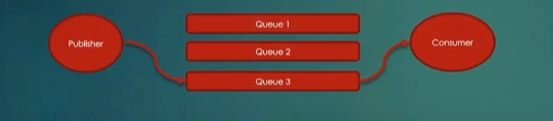

# Point To Point Tasarım

Publisher mesajı direkt olarak bir kuyruğa gönderir ve bu mesaj kuyruğu işleyen/dinleyen consumer tarafından tüketilir. Eğer bu senaryo gereği bir mesajın bir tüketici tarafından işlenmesi gerekiyorsa bu yaklaşım kullanılır.

Queue Declare edilirken direkt olarak queue name belirtilir.

En ilkel RabbitMQ davranışını sergilememiz yeterli olan Tasarım Modelidir.

<u>P2P tasarımı gerektiren senaryolarda genellikle direct exchange kullanılmaktadır.</u>