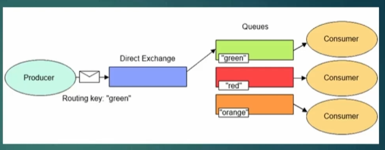

# Direct Exchange

Mesajların direkt olarak belirli bir kuyruğa gönderilmesini sağlayan exchange'dir.
Exchange'e gönderilen mesajlar, exchange'e bağlanan kuyruklara gönderilir. Gönderilecek queue'nun adının routingKey'de belirtilmesi yeterlidir.
