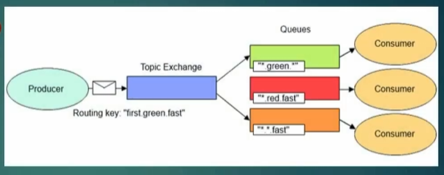

# Topic Exchange

Routing key'leri kullanarak mesajları kuyruklara yönlendirmek için kullanılan exchange'dir.
Bu exchange ile routing key'in bir kısmına/formatına/yapısına/yapısındaki keylere göre kuyruklara mesajlar gönderilir.

Kuyruklar da routing key'e göre bu exchange'e abone olabilir ve sadece ilgili routing key'e göre gönderilen mesajları alabilirler.

1. # => Tek bir kelimeyi temsil eder.
2. * => Olduğu yer ne olursa olsun farketmez.
