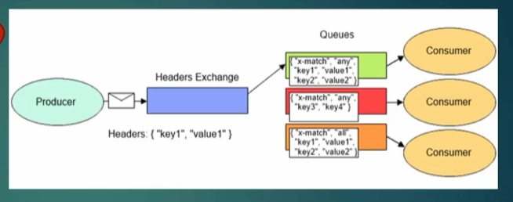

# Header Exchange 

Routing key yerine Header'ları kullanarak mesajları kuyruk/kuyruklara yönlendirmek için kullanılan exchange'dir.

Exchange türleri farketmeksizin tüm exchange'lerde  headers denilen ekstra bilgiler tutabileceğimiz alanlar vardır,bu alanlar kuyruklarda da mevcuttur.Key value formatında veriler tutulabilir.

Bir key value değerinin queue ile eşleşmesi ya da birden fazlasının eşleşmesi durumları tercihimize kalmış durumlardır.

<strong>X-Match : İlgili queue'nın mesajı hangi davranışla alacağının kararını veren bir keydir.</strong>
Any ve All değerlerini alabilir.
1. Any : İlgili queue'nun sadece tek bir key value değerinin eşleşmesi durumunda mesajı alır.
2. All : İlgili queue'nun tüm key value değerlerinin eşleşmesi durumunda mesajı alır.